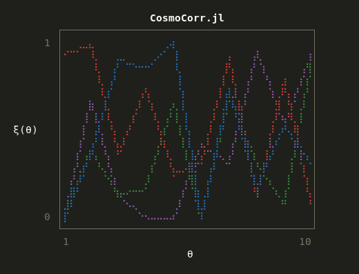

# CosmoCorr  

A ***Probabilistic*** and ***Differentiable*** Julia package for calculating 2 pt correlation functions for Cosmological analysis. Uses Fuzzy C Means and sigmoid binning.



Docs and project details are available [here](https://cosmo-corr.netlify.app/)

If you use this code in your research, please cite

```
@misc{CosmoCorr,
  author = {Edward Berman},
  title = {CosmoCorr: Cosmological Correlation Function Estimator},
  year = {2024},
  howpublished = {\url{https://github.com/EdwardBerman/CosmoCorr}},
  note = {Accessed: 2024-09-23}
}
```

